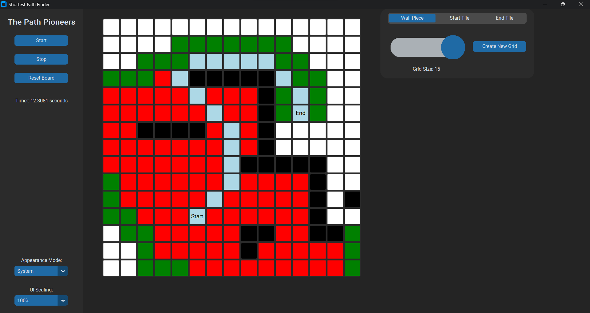

# The Path Pioneers

A Python GUI application provides that visually represents the A* algorithm, a popular pathfinding algorithm widely used in computer science and robotics. The GUI enables users to interactively set a start point, an end point, and observe the algorithm finding the optimal path in a grid-based environment.

## How to run

1. Make sure you have Python 3.11 installed on your system. You can download the latest version of Python from the official website: [Python Downloads](https://www.python.org/downloads/)

2. Open a command-line interface or terminal.

3. Install the CustomTkinter library using the following command:
```
pip3 install customtkinter
```

## Usage

1. Run the Python script main.py:
```
python main.py
```
2. The GUI window will appear, displaying a grid environment.

3. To place walls, click the mouse over the desired cells. Walls obstruct the pathfinding algorithm.

4. To set the start point, click on an empty cell in the grid.

5. To set the end point, click on another empty cell in the grid.

6. Click the "Start" button to begin the A* algorithm simulation.

7. As the simulation runs, the GUI will visualize the algorithm's exploration and highlight the optimal path from the start point to the end point.

8. After the simulation completes, you can click the "Stop" button to pause the visualization and edit the grid.

9. To clear the entire grid and restart, click the "Reset Grid" button.

10. You can adjust the size of the grid using the slider and click the "Create New Grid" button to generate a new square grid of the selected size.

11. Change the UI Scaling as needed.

## Example


## Credits
Made by Max Bodifee & Louis Luu
